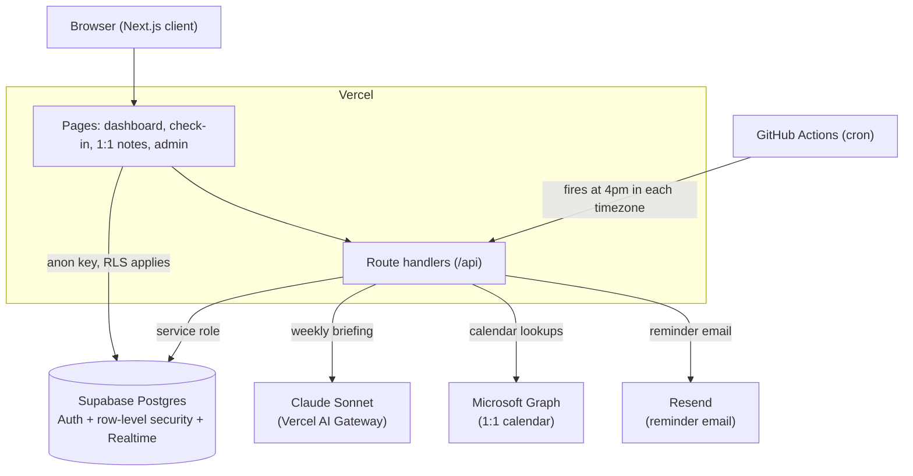

# Strategic Execution Platform

[](https://github.com/mermilke/strategic-execution-platform/actions/workflows/ci.yml)

**▶ [Live demo](https://strategic-execution.vercel.app)** -- one click, no signup, as a manager or a team member.

Strategic Execution Platform keeps a management team aligned on its long-term
goals. Each
direct report spends about a minute a week marking where their strategic
objectives stand; the manager gets a live dashboard of what's on track, what's
at risk, who needs help, and what to bring up in the next 1:1, plus an AI-written
weekly briefing that sums it up.

## Background

Strategy is the first thing to slip when everyone is heads-down on this week's
fires. The day-to-day tactical work always feels more urgent, so the long-term
initiatives -- the ones that actually move the business -- quietly stall. You can
spend all year chopping wood and never stop to sharpen the axe. The usual
checkpoint is a quarterly or mid-year review, and by then a stalled initiative
has already lost months.

I built Strategic Execution Platform to close that gap. A manager assigns each direct report
a few strategic objectives, and every week each report takes about a minute to
say where those objectives stand. The hard part of any weekly habit is friction:
if it feels like a chore, people stop doing it. So the whole thing is built to be
nearly effortless --

- **Last week's status carries over automatically.** If nothing changed, there
  is nothing to do.
- **Changing a status takes one click, but it asks for a short reason** -- so a
  slip from "on track" to "at risk" never goes by unexplained.
- **The one thing everyone confirms each week is a single yes/no:** did this move
  this week? That question is what drives visibility and accountability.
- **Comments are optional**, there when a report wants to add detail and never
  required.

The result is a continuous, honest read on the strategic work instead of a
twice-a-year surprise. The manager gets quick-glance status tiles, an AI summary
of the week, and calendar context showing when each check-in is due and when the
next 1:1 is, so that meeting is spent on the real blockers rather than gathering
status.

It started as a tool for senior leadership -- keeping a leadership team's
strategic initiatives on track -- but nothing about it is specific to the
C-suite. It works for any manager and their team.

## Screenshots

The manager's team overview, with every report's objectives at a glance:


| Weekly check-in | A direct report's dashboard |
| --- | --- |
|  |  |

| Shared 1:1 notes | Managing people and objectives |
| --- | --- |
|  |  |

## What it does

For direct reports:

- A weekly check-in form that pre-fills last week's status for each
  sub-objective, so an update takes about a minute.
- Each item captures a status (on track, at risk, off track, on hold, not
  started, completed), whether any progress was made, a "needs support" flag, a
  "discuss in the 1:1" flag, and free-text comments.

For the manager or an admin:

- A team overview with one tile per person, showing every objective and
  sub-objective at a glance and color-coded by status. Anything that hasn't
  moved in a couple of weeks picks up a stale counter.
- Filters for the things you actually chase: missing submissions, at-risk
  items, anything flagged for support, or items with no recent update.
- Per-person history with the full week-by-week trail for any objective.
- Opportunity objectives, which are a different kind of goal measured by a count
  (say, "close 5 enterprise pilots") with the individual deals listed under it.
- An analytics view with trends across the team.
- A Weekly Briefing: a Claude-generated summary of the week, with a headline,
  risks, momentum, and per-person talking points for upcoming 1:1s. It streams
  in as the model writes it and is cached per week, with the token usage and
  cost recorded alongside each one.
- 1:1 notes: a shared notes pad per person per week that syncs in real time,
  takes file and link attachments, and shows the next scheduled 1:1 from the
  calendar.

Automation:

- Reminder emails that arrive at 4pm in each direct report's own timezone, the
  day before their 1:1. The logic reads the calendar, so it can tell "not due
  yet" from "overdue" from "your 1:1 was cancelled," and it stops once the
  check-in is in.

## Tech

- TypeScript across the app, type-checked in CI
- Next.js 14 (App Router) and React 18
- Supabase for Postgres, auth, row-level security, Realtime, and storage
- The Vercel AI SDK over the Vercel AI Gateway, using Claude Sonnet for the
  briefing (structured output with Zod, plus prompt caching)
- Resend for the reminder email
- Microsoft Graph for the shared 1:1 calendar (optional)
- The Smartsheet API for an optional extra discussion feed
- Recharts, date-fns, and Tailwind CSS
- Runs on Vercel; the reminder cron is driven by GitHub Actions

## Architecture



<details>
<summary>Plain-text version</summary>

```
Browser (Next.js client)
    |-- reads/writes (anon key, RLS applies) --> Supabase Postgres
    |                                            (Auth + row-level security + Realtime)
    '-- calls --> Route handlers (/api)
                      |-- service role --------> Supabase Postgres
                      |-- weekly briefing -----> Claude Sonnet (Vercel AI Gateway)
                      |-- calendar lookups ----> Microsoft Graph
                      '-- reminder email ------> Resend

GitHub Actions (cron) -- fires at 4pm per timezone --> /api/cron/reminders
```

</details>

## How it's put together

```
app/
  page.tsx                Entry point; routes to login or dashboard
  login/  reset-password/ Supabase email/password and magic-link auth
  dashboard/              Renders the manager or direct-report view by role
  checkin/                The weekly check-in form
  meeting/                1:1 notes, attachments, next-meeting lookup
  admin/                  Manage people and objectives
  api/
    ai/insights/          Streams and caches the weekly briefing
    calendar/             Microsoft Graph calendar reads
    cron/reminders/       Timezone- and calendar-aware reminder emails
    smartsheet/           Optional "Other Topics" feed
    auth/  admin/         OAuth callback, admin password reset
components/               Dashboards, briefing UI, charts, navbar, badges
lib/
  supabase.ts  auth.ts    Browser and server Supabase clients
  briefing-context.ts     Assembles the data the briefing model sees
  utils.ts                Week math and status config
supabase_setup.sql        Schema, row-level security, triggers
seed.sql                  Fictional demo team (optional)
```

Access control lives in Postgres. Every table has row-level security, so a
direct report can only read and write their own objectives and check-ins, while
the manager and admins see everyone. The server-only routes (briefing, cron,
admin password reset) use the service-role key and never run in the browser.

For the deeper version, including the AI briefing pipeline and the
timezone-aware reminder logic, see [ARCHITECTURE.md](docs/ARCHITECTURE.md).

## Running it locally

You'll need Node.js 20+ and a free [Supabase](https://supabase.com) project. New
to Next.js or Supabase? The [setup guide](docs/SETUP_GUIDE.md) walks through all
of this click by click.

1. Install dependencies:
   ```bash
   npm install
   ```

2. Copy `.env.example` to `.env.local` and fill in at least the Supabase keys
   and `NEXT_PUBLIC_SITE_URL`. The other blocks are optional; the app runs
   without them, you just don't get that feature.

3. Open the Supabase SQL editor and run [`supabase_setup.sql`](supabase_setup.sql)
   to create the schema.

4. Optionally run [`seed.sql`](seed.sql) to load a fictional team to click
   around. Sign in with any of the seeded addresses (for example the manager,
   `jordan.hayes@example.com`) using the password `demo1234`.

5. Start it:
   ```bash
   npm run dev
   ```
   The app runs at http://localhost:3000.

If you skip the seed, sign up through the app and then change your row's `role`
to `admin` in the Supabase `users` table to get the manager views.

## Tests

Tests run on [Vitest](https://vitest.dev) and cover the date and status logic
plus the dashboard and admin React components (jsdom + Testing Library):

```bash
npm test
```

A separate suite of row-level-security integration tests runs against a local
Supabase Postgres, exercising the RLS policies as real signed-in users:

```bash
npm run test:integration   # needs Docker + `npx supabase start`
```

GitHub Actions type-checks, runs the unit tests, and does a production build on
every push and pull request (see [`.github/workflows/ci.yml`](.github/workflows/ci.yml)).

## Deploying

Import the repo into Vercel and add the same environment variables in the
project settings. The reminder schedule lives in
[`.github/workflows/reminder-cron.yml`](.github/workflows/reminder-cron.yml),
which pings the deployed `/api/cron/reminders` endpoint at a handful of UTC
times so it catches 4pm in each region. Set an `APP_URL` Actions variable (your
deployed base URL) and a `CRON_SECRET` Actions secret that matches the
`CRON_SECRET` you set on Vercel.

## Optional integrations

- The **AI briefing** needs `AI_GATEWAY_API_KEY`. Leave it out and everything
  else still works; the briefing card just stays dormant.
- The **calendar** needs an Azure AD app with delegated `Calendars.Read.Shared`
  and `MANAGER_CALENDAR_EMAIL` set to the shared mailbox. It drives the "next 1:1"
  lookup and the reminder timing.
- **Reminder email** needs a Resend API key and a verified sender address.
- **Smartsheet** stays off unless `NEXT_PUBLIC_SMARTSHEET_USER_EMAIL` is set.

## Limitations & future work

Things I'm aware of and would improve given time:

- **Route-level test coverage is partial.** Vitest covers the date and status
  logic and the dashboard and admin components, and a suite of integration tests
  exercises the row-level-security policies against a local Postgres. The API
  route handlers themselves are still verified by hand; integration tests around
  them would make refactors safer.
- **The 1:1 calendar match is heuristic.** Reminders identify each report's 1:1
  by matching calendar event titles against common name patterns, so an unusually
  titled meeting can be missed. Matching on a stable calendar category or the
  attendee list would be more robust.
- **Reminders fire on a fixed UTC schedule.** The cron pings a handful of UTC
  times to approximate 4pm across regions rather than each report's exact local
  time. Per-user scheduled jobs would be more precise.

Features I'd add next, roughly in order of value:

- **Comment loop** so the manager can leave a question on a specific at-risk item
  and the report sees it on their next check-in. Right now that conversation only
  happens in the free-form 1:1 notes.
- **Email or PDF of the weekly briefing**, so it can go out Monday morning
  instead of living only on the dashboard.
- **Objective target dates surfaced** as countdowns and overdue flags (the data
  is already there).
- **Slack/Teams delivery** of the briefing and at-risk alerts.

## License

Copyright © 2026 Mercedes Milke. All rights reserved. The code is here to read, not to reuse
(see [LICENSE](LICENSE)). It isn't licensed for reuse, redistribution, or
deployment.
