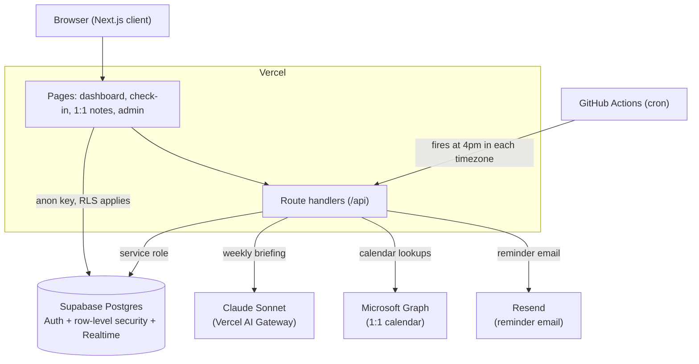

# Strategic Execution Platform

[](https://github.com/mermilke/strategic-execution-platform/actions/workflows/ci.yml)

**▶ [Live demo](https://strategic-execution.vercel.app)** -- one click, no signup, as a manager or a direct report.

Strategic Execution Platform is a full-stack web app for keeping long-term
strategic goals visible between formal review cycles. Each direct report spends
about a minute a week on a lightweight check-in of their assigned objectives,
while the manager gets a live view of what's on track, what's at risk, who needs
help, and what to bring up in the next 1:1, plus an AI-written weekly briefing
that sums it up.

It pulls together role-based dashboards, weekly check-ins, shared 1:1 notes,
calendar-aware reminders, and an AI-generated weekly briefing built with Claude
through the Vercel AI Gateway.

## What this project demonstrates

- Full-stack application development with Next.js, TypeScript, Supabase, and Vercel
- Role-based access control enforced with Supabase row-level security
- AI feature integration with structured output, streaming responses, per-week caching, and usage/cost tracking
- Calendar-aware automation for reminder timing and 1:1 context
- CI coverage for type-checking, unit tests, production builds, schema-sync verification, and RLS integration tests
- Product design around a real management workflow: reducing friction, increasing accountability, and surfacing risk earlier

## Background

Strategic work often loses visibility between quarterly or mid-year reviews.
Day-to-day operational work feels more urgent, so the long-term initiatives -- the
ones that actually move the business -- can stall for weeks before there's a clear
signal that something is off track.

I built Strategic Execution Platform to make strategic progress visible on a
weekly cadence without turning status updates into another heavy process. A
manager assigns each direct report a small set of objectives. Each week, the
report reviews those objectives, confirms whether progress was made, updates the
status if needed, and flags anything that needs support or should be discussed in
their next 1:1. The hard part of any weekly habit is friction, so the whole thing
is built to be nearly effortless:

- **Last week's status carries forward automatically.** If nothing changed, there
  is nothing to do.
- **Changing a status takes one click, but asks for a short reason** -- so a slip
  from "on track" to "at risk" never goes by unexplained.
- **Each check-in centers on one accountability question:** did this move this
  week?
- **Comments are optional**, there when a report wants to add detail and never
  required.

The result is a continuous, honest read on strategic execution -- what's on
track, what's stale, what needs support, and what to discuss before the next
formal review -- instead of a twice-a-year surprise.

It started as a tool for senior leadership, keeping a leadership team's strategic
initiatives on track, but nothing about it is specific to the C-suite. It works
for any manager and their team.

## Screenshots

The manager's team overview, with every report's objectives at a glance:


| Weekly check-in | A direct report's dashboard |
| --- | --- |
|  |  |

| Shared 1:1 notes | Managing people and objectives |
| --- | --- |
|  |  |

## What it does

### Direct report workflow

- Complete a weekly check-in for assigned objectives and sub-objectives, starting
  from last week's status so unchanged items take only a few seconds to confirm.
- Mark each item as on track, at risk, off track, on hold, not started, or
  completed, and record whether any progress was made.
- Flag items that need manager support or should be discussed in the next 1:1.
- Add optional comments when more context helps.

### Manager and admin workflow

- A team overview with one tile per person, every objective and sub-objective
  color-coded by status, and a stale counter on anything that hasn't moved in a
  couple of weeks.
- Filters for the common follow-up categories: missing submissions, at-risk
  items, support needs, and items with no recent update.
- Per-person history with the full week-by-week trail for any objective.
- Opportunity objectives -- count-based goals (say, "close 5 enterprise pilots")
  with the individual deals listed under them.
- An analytics view with status trends across the team.
- Shared 1:1 notes per person per week, with file and link attachments and the
  next scheduled 1:1 pulled from the calendar.
- A weekly AI briefing: a Claude-generated summary with a headline, risks,
  momentum, and per-person talking points for upcoming 1:1s. It streams in as the
  model writes it and is cached per week, with token usage and cost recorded
  alongside each one.

### Automation

- Reminder emails that arrive at 4pm in each direct report's own timezone, the
  day before their 1:1. The logic reads the calendar, so it can tell "not due
  yet" from "overdue" from "your 1:1 was cancelled," and it stops once the
  check-in is in.
- The reminder endpoint is protected with a cron secret and triggered by GitHub
  Actions.

## Tech stack

- **Frontend:** Next.js 14 (App Router), React 18, TypeScript, Tailwind CSS
- **Backend:** Next.js route handlers, Supabase Postgres, Supabase Auth, Supabase Storage
- **Access control:** Supabase row-level security with manager/admin/direct-report roles
- **AI:** the Vercel AI SDK over the Vercel AI Gateway, using Claude Sonnet for the weekly briefing
- **AI reliability:** Zod-structured output, streamed responses, per-week caching, and token/cost tracking
- **Automation:** GitHub Actions cron, Resend for the reminder email, Microsoft Graph for the shared 1:1 calendar
- **Data visualization:** Recharts (with date-fns for the week math)
- **Testing and CI:** Vitest, Testing Library, Supabase RLS integration tests, GitHub Actions

## Architecture



<details>
<summary>Plain-text version</summary>

```
Browser (Next.js client)
    |-- reads/writes (anon key, RLS applies) --> Supabase Postgres
    |                                            (Auth + row-level security + Realtime)
    '-- calls --> Route handlers (/api)
                      |-- service role --------> Supabase Postgres
                      |-- weekly briefing -----> Claude Sonnet (Vercel AI Gateway)
                      |-- calendar lookups ----> Microsoft Graph
                      '-- reminder email ------> Resend

GitHub Actions (cron) -- fires at 4pm per timezone --> /api/cron/reminders
```

</details>

## How it's put together

```
app/
  page.tsx                Entry point; routes to login or dashboard
  login/  reset-password/ Supabase email/password and magic-link auth
  dashboard/              Renders the manager or direct-report view by role
  checkin/                The weekly check-in form
  meeting/                1:1 notes, attachments, next-meeting lookup
  admin/                  Manage people and objectives
  api/
    ai/insights/          Streams and caches the weekly briefing
    calendar/             Microsoft Graph calendar reads
    cron/reminders/       Timezone- and calendar-aware reminder emails
    smartsheet/           Optional "Other Topics" feed
    auth/  admin/         OAuth callback, admin password reset
components/               Dashboards, briefing UI, charts, navbar, badges
lib/
  supabase.ts  auth.ts    Browser and server Supabase clients
  briefing-context.ts     Assembles the data the briefing model sees
  calendar-match.ts       Shared 1:1 calendar matcher and Graph event type
  utils.ts                Week math and status config
supabase/migrations/      Schema source of truth (applied by the Supabase CLI)
supabase_setup.sql        The same schema as one file for the SQL editor (generated)
seed.sql                  Fictional demo team (optional)
```

Access control is enforced in Postgres, not just in the UI. Client-side reads and
writes use the Supabase anon key and are constrained by row-level security, so a
direct report can only reach their own objectives, check-ins, and notes, while
managers and admins get the team-wide views. The server-only routes handle the
privileged work -- AI briefing generation, reminder processing, calendar lookup,
and admin password reset -- with the service-role key, which never reaches the
browser.

For a deeper walkthrough of the AI briefing pipeline, the timezone-aware reminder
logic, and the data model, see [ARCHITECTURE.md](docs/ARCHITECTURE.md).

## Running it locally

You'll need Node.js 20+ and a free [Supabase](https://supabase.com) project. New
to Next.js or Supabase? The [setup guide](docs/SETUP_GUIDE.md) walks through all
of this click by click.

1. Install dependencies:
   ```bash
   npm install
   ```

2. Copy `.env.example` to `.env.local` and fill in at least the Supabase keys
   and `NEXT_PUBLIC_SITE_URL`. The other blocks are optional; the app runs
   without them, you just don't get that feature.

3. Open the Supabase SQL editor and run [`supabase_setup.sql`](supabase_setup.sql)
   to create the schema.

4. Optionally run [`seed.sql`](seed.sql) to load a fictional team to explore. Sign
   in with any of the seeded addresses (for example the manager,
   `jordan.hayes@example.com`) using the password `demo1234`.

5. Start it:
   ```bash
   npm run dev
   ```
   The app runs at http://localhost:3000.

If you skip the seed, sign up through the app and then change your row's `role`
to `admin` in the Supabase `users` table to get the manager views.

## Tests and CI

Unit tests run on [Vitest](https://vitest.dev) and cover the date and status
logic plus the dashboard and admin React components (jsdom + Testing Library):

```bash
npm test
```

A separate suite exercises the row-level-security policies against a local
Supabase stack, as real signed-in users:

```bash
npm run test:integration   # needs Docker, Node 22+, and `npx supabase start`
```

(Node 22+ only for this suite -- the supabase-js client it signs in with needs a
global `WebSocket`, which Node ships from 22. The app and unit tests run on 20.)

GitHub Actions type-checks, verifies `supabase_setup.sql` is in sync with the
migrations, runs the unit tests, and does a production build on every push and
pull request. A separate job stands up a local Supabase stack and runs the
row-level-security integration tests, so a change that weakens an access rule
fails CI rather than slipping through (see
[`.github/workflows/ci.yml`](.github/workflows/ci.yml)).

## Deploying

Import the repo into Vercel and add the same environment variables in the
project settings. The reminder schedule lives in
[`.github/workflows/reminder-cron.yml`](.github/workflows/reminder-cron.yml),
which pings the deployed `/api/cron/reminders` endpoint at a handful of UTC
times so it catches 4pm in each region. Set an `APP_URL` Actions variable (your
deployed base URL) and a `CRON_SECRET` Actions secret that matches the
`CRON_SECRET` you set on Vercel.

## Optional integrations

- The **AI briefing** needs `AI_GATEWAY_API_KEY`. Leave it out and everything
  else still works; the briefing feature simply stays disabled.
- The **calendar** needs an Azure AD app with delegated `Calendars.Read.Shared`
  and `MANAGER_CALENDAR_EMAIL` set to the shared mailbox. It drives the "next 1:1"
  lookup and the reminder timing.
- **Reminder email** needs a Resend API key and a verified sender address.
- **Smartsheet** stays off unless `NEXT_PUBLIC_SMARTSHEET_USER_EMAIL` is set.

## Known limitations and future work

This is a portfolio-ready application, not a fully enterprise-hardened system.
The main areas I would improve next:

- **Route-level test coverage is partial.** Vitest covers the date and status
  logic and the dashboard and admin components, and a suite of integration tests
  exercises the row-level-security policies against a local Postgres. The API
  route handlers themselves are still verified by hand; integration tests around
  them would make refactors safer.
- **The 1:1 calendar match is heuristic.** The briefing and the reminders
  identify each report's 1:1 by matching calendar event titles against common
  name patterns (shared matcher in `lib/calendar-match.ts`), so an unusually
  titled meeting can be missed. Matching on a stable calendar category or the
  attendee list would be more robust.
- **The shared 1:1 notes are last-write-wins, not a true concurrent editor.**
  Each edit broadcasts the whole notes field and the other side replaces its
  copy, which is fine for the usual case (one person typing during the call) but
  means simultaneous edits can overwrite each other. A merge/CRDT or operational
  transform would be needed for real co-editing. The live channel is also a plain
  Supabase broadcast, which isn't access-controlled by row-level security the way
  the persisted notes are; moving it to a private, RLS-authorized channel would
  close that gap.
- **Reminders fire on a fixed UTC schedule.** The cron pings a handful of UTC
  times to approximate 4pm across regions rather than each report's exact local
  time. Per-user scheduled jobs would be more precise.
- **The reminder cron queries one report at a time.** Each run loops the direct
  reports and fetches calendar, reminder history, and check-in state per person.
  That's fine for a team of five to ten, but it wouldn't scale to hundreds;
  batching those lookups into grouped queries and a single calendar pull is the
  fix.
- **Microsoft OAuth tokens are stored unencrypted.** They live in a table locked
  to the service role with row-level security and no client policies, so the app
  never hands them out, but at rest they're plaintext. Encrypting them with
  Supabase Vault / pgsodium would be the production-grade step.
- **Briefing generation isn't guarded against a concurrent double-run.** The
  weekly AI briefing is cached per week behind a unique constraint, so the stored
  row can't be corrupted, but two managers generating at the same instant would
  both miss the cache and both call the model. Claiming the row first
  (insert-on-conflict) or a short advisory lock would stop the double spend.
- **A few client components still type some Supabase results loosely.** Most
  query results and state are typed against the generated row types, but a handful
  of form-state maps and the streamed-briefing JSON walker still use `any` where
  tightening them buys little. Finishing that is mechanical.

## Future features

Roughly in order of value:

- **Comment loop** so the manager can leave a question on a specific at-risk item
  and the report sees it on their next check-in. Right now that conversation only
  happens in the free-form 1:1 notes.
- **Email or PDF of the weekly briefing**, so it can go out Monday morning
  instead of living only on the dashboard.
- **Objective target dates surfaced** as countdowns and overdue flags (the data
  is already there).
- **Slack/Teams delivery** of the briefing and at-risk alerts.
- **Configurable integrations with external work systems** such as Smartsheet,
  OneNote, SharePoint, and other planning and documentation tools. The private
  version of this app already supports company-specific integrations, but a
  production version should use a native integration layer so objective updates,
  meeting notes, and supporting context can sync automatically instead of being
  copied manually between systems.

## License

Copyright © 2026 Mercedes Milke. All rights reserved. This repository is published
for portfolio review and source-code visibility only. It is not licensed for
reuse, redistribution, or deployment. See [LICENSE](LICENSE).
